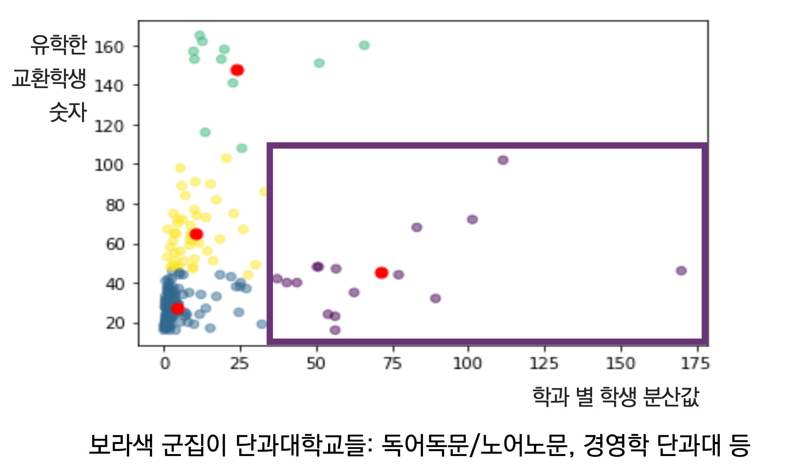
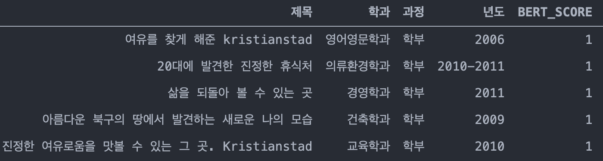
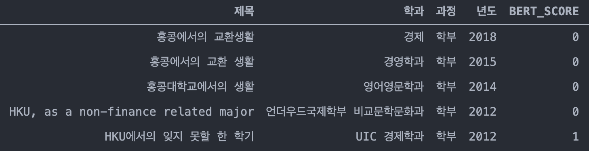
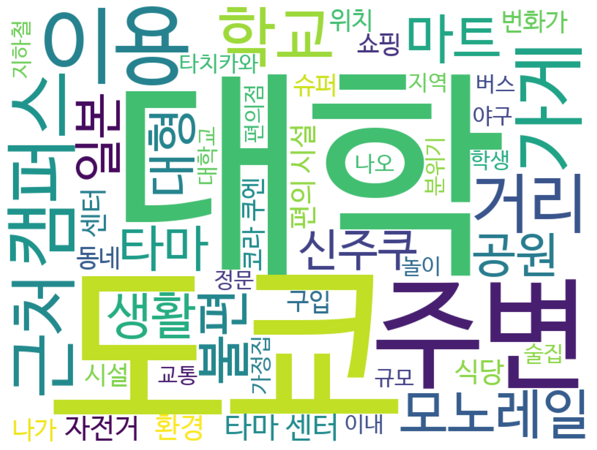
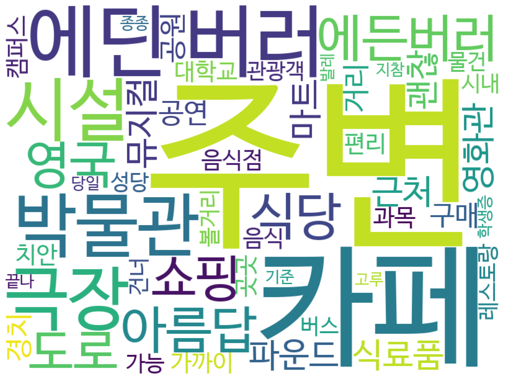

# Yonsei Exchange Universities Analysis

[🛤 yonsei.exchange Website Demo](https://yonsei-exchange.netlify.app/)

Text Analysis for the source of yonsei.exchange website
2020년 8월 기준 총 11200여 건의 해외 교환 생활 리뷰 텍스트 데이터를 요약 정리한 웹사이트. 교환 후기 데이터는 연세대 학생들이 해외 교환 대학에서 복귀한 직후 의무적으로 작성한 후기임. 

## Goals

- [x] Clustering Universities with their Provided Majors: 각 해외 교환 대학 별 학과 분포 분석 및 군집화
- [x] Analyzing Sentiments for Universities: 각 해외 교환 대학 별 만족도 예측
- [x] Extracting Keywords from Reviews of Universities: 각 해외 교환 대학 별 키워드 추출 
- [x] Summarizing Reviews for Universities: 각 해외 교환 대학 별 후기 요약

## I. Clustering Universities with Majors

* [K-means Clustering with Majors](./cluster_departments.ipynb)

## II. Sentiment Analysis for Foreign Universities

* [Labeling with BERT model trained with NSMC Corpus](./analyze_BERT_nsmc.ipynb)
* [Labeling with RNN trained with NSMC Corpus](./analyze_RNN.ipynb)

교환 후기 제목들과 이에 대한 BERT, RNN Labeling. 1이 긍정, 0이 부정 혹은 중립

**Example 1: Kristianstad University (Sweden)**

**Example 2: The University of Hong Kong (Hong Kong)**

## III. Extracting Keywords from Reviews of Universities

* [Extracting 50 keywords for each university && Generating wordclouds](./extract_keyword_term_frequency.ipynb)

**Example 1: Chuo University (Japan)**

**Example 2: The University of Edinburgh (United Kingdom)**

## IV. Summarizing Reviews for Universities

* [Summarizing reviews into 10 sentences for each university, using textrank](./summarize_textrank.ipynb)

**Example 1: Nagasaki University (Japan)**

* `나가사키에 위치해 있고 나가사키 대학교는 3개의 캠퍼스로 나뉜다. `
* `나가사키는 상당히 남쪽에 위치하기 때문에 겨울에도 그렇게 추운편이 아니다. `
* `나가사키대학은 나가사키현의 나가사키시에 위치해 있으며 3개의 작은 캠퍼스로 이루어져 있다. `

**Example 2: University of Copenhagen (Denmark)**

* `코펜하겐의 여름은 날씨가 굉장히 좋고 아름답습니다. `
* `어둡고 추운 겨울을 견디고 오는 코펜하겐의 봄, 여름 날씨는 환상적입니다. `
* `코펜하겐 대학은 캠퍼스가 아닙니다.`

## Explaning Datasets in data_wrangled Folder

* Collected using [collect_reviews.ipynb](./collect_reviews.ipynb)
* 2020년 8월 기준 총 11200여 건의 리뷰데이터들을 모아놓음. 연세대 학생들은 해외 교환 대학에서 복귀한 직후 의무적으로 후기를 작성해왔음. 각 해외 파견 대학들의 연세대 학생 리뷰 텍스트 데이터를 정리함. 

### [df_univ_wrangled.csv](./data_wrangled/df_univ_wrangled.csv)

연세대에서 갈 수 있는 해외 교환 대학들을 정리함. 하단은 각 column 별 설명.

* 대학코드: 연세대 국제처가 대학들을 분류하는 코드
* 국가: 해당 교환대학의 소속 국가.
* 대학명: 대학의 정식 명칭.
* 파견구분: 교환학생 프로그램 종류를 의미함.
* 협정형태: 교환학생 프로그램 종류의 상위 카테고리.
* NUM_VISITS: 해당 대학에 교환학생이 몇 명이 갔다왔는지를 의미함. 후기 숫자.
* BERT_SUM: NSMC로 학습한 BERT 모델이 긍/부정 레이블한 숫자(0,1의 integer)들의 합
* RNN_SUM: NSMC로 학습한 RNN 모델이 긍/부정 레이블한 숫자(0에서 1사이의 float)들의 합
* href: 해당 대학 리뷰들이 위치한 웹사이트 쿼리. root url은 oia.yonsei.ac.kr

### [df_abstract_wrangle.csv](./data_wrangled/df_abstract_wrangle.csv)

각 대학 별로 학생들의 후기들의 제목을 정리한 데이터셋. 하단은 각 column 별 설명.

* 대학코드: 연세대 국제처가 대학들을 분류하는 코드
* 제목: 학생들이 작성한 리뷰의 제목
* 학과: 학생들의 연세대 소속 학과. 학생이 해외 교환대학에서 수료한 학과는 상이할 수 있음. 같은 학과라도 학생들이 표기하는 방법은 제각각(ex: UIC Economics / UD / UD Economics / UD 경제 / UD 경제학 등)
* 년도: 파견 년도
* BERT_SCORE: [Labeled with BERT model trained with NSMC Corpus](./analyze_BERT_nsmc.ipynb). 0과 1의 integer.
* RNN_SCORE: [Labeled with RNN trained with NSMC Corpus](./analyze_RNN.ipynb). 0과 1 사이의 float.
* href: 해당 학생의 리뷰가 위치한 웹사이트 쿼리. root url은 oia.yonsei.ac.kr

### [df_specific_wrangle.csv](./data_wrangled/df_specific_wrangle.csv)

학생들은 귀국 직후 아홉 가지 항목에서 질문을 받으며, 각 항목에 대한 학생들의 답변을 각 대학 별로 데이터를 모음. 질문에 대한 응답은 글자수 제한이 없어서 세세한 부분까지 자세하게 작성되어 있음. 종종 영어로도 작성된 후기들이 존재함. 하단은 각 column 별 설명.

* 대학코드: 연세대 국제처가 대학들을 분류하는 코드
* 대학명: 대학의 정식 명칭.
* 국가: 해당 교환대학의 소속 국가.
* gen_info: 교환대학의 크기, 지리적 위치, 기후 등
* env_info: 대학 주변 환경
* food_info: 거주 형태, 식사
* study_info: 수업, 도서관
* office_info: 국제교육부
* facil_info: 기타 학교에 관한 정보(부대시설, 동아리 등)
* mhct_info: Culture Shock
* help_info: 도움 받을 수 있는 곳(교내외)
* etc_info: 기타
