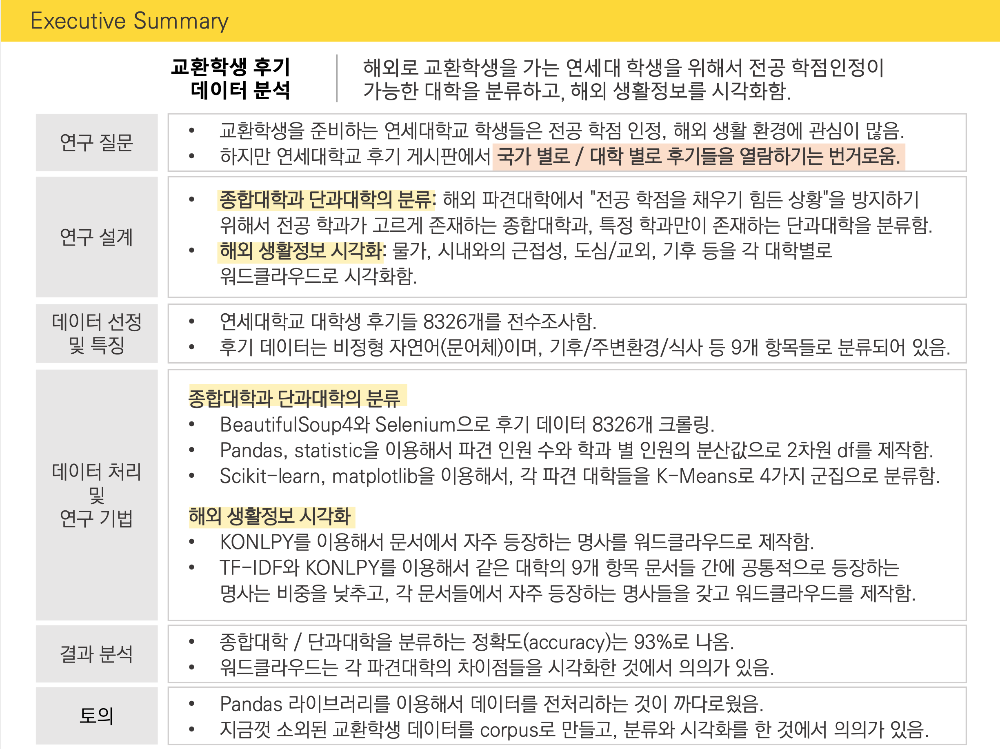

# Yonsei Exchange Universities Analysis

## Goals

* Clustering university with their provided majors
* Summarizing reviews for university
* Sentiment analysis for university

## Dataset Explanation on [data folder](./data)

Collected using [collect_reviews.ipynb](./collect_reviews.ipynb)

### [univ_db_full.csv](./data/univ_db_full.csv)

연세대에서 갈 수 있는 해외 교환 대학들을 정리함.

* 대학명: 대학의 정식 명칭
* 국가: 해당 대학의 소속 국가
* 파견구분: 교환학생 프로그램 종류를 의미함
* 협정형태: 교환학생 프로그램 종류의 상위 카테고리
* href: 해당 대학 리뷰들이 위치한 웹사이트 쿼리. root url은 oia.yonsei.ac.kr
* visitaiton: 기존에 교환 프로그램을 참가한 학생이 있는지를 의미함 (None or Exists)

### [univ_text_data](./data/univ_text_data)

연세대 학생들은 해외 교환 대학에서 복귀한 직후 의무적으로 후기를 작성해왔음. 각 해외 파견 대학들의 연세대 학생 리뷰 텍스트 데이터를 정리함. 총 8000여 건의 리뷰데이터들을 모아놓음. 

**_review_abstract**

각 대학 별로 학생들의 후기를 간단하게 정리한 데이터셋. 하단은 각 column 별 설명.

* 제목: 학생들이 작성한 리뷰의 제목
* 학과: 학생들의 연세대 소속 학과. 학생이 해외 교환대학에서 수료한 학과는 이와 상이할 수 있음.
* 년도: 파견 년도
* href: 해당 학생의 리뷰가 위치한 웹사이트 쿼리. root url은 oia.yonsei.ac.kr

**_review_specific**

학생들은 귀국 직후 아홉 가지 항목에서 질문을 받으며, 각 항목에 대한 학생들의 답변을 각 대학 별로 데이터를 모음. 하단은 각 column 별 설명.

* gen_info: 교환대학의 크기, 지리적 위치, 기후 등
* env_info: 대학 주변 환경
* food_info: 거주 형태, 식사
* study_info: 수업, 도서관
* office_info: 국제교육부
* facil_info: 기타 학교에 관한 정보(부대시설, 동아리 등)
* mhct_info: Culture Shock
* help_info: 도움 받을 수 있는 곳(교내외)
* etc_info: 기타